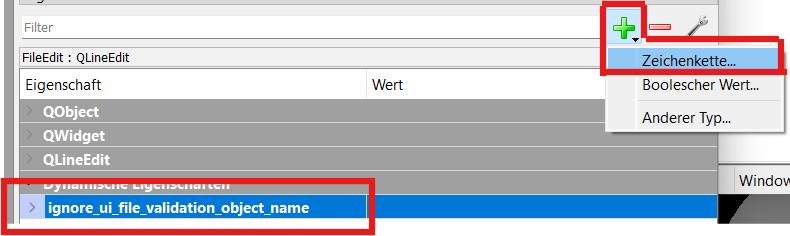

<!--
SPDX-FileCopyrightText: 2025 Deutsche Telekom Technik GmbH <f.vonstudsinske@telekom.de>

SPDX-License-Identifier: GPL-3.0-only
-->

# UI File Validation

A basic quality gate exists, to check the Qt object names against a config.

E.g. a `QPushButton` should not named like `button1` but should named like `But_Close`.

To ignore a name check for a QWidget within the UI file, the attribute `` can be set with the QtDesigner.



1. Click on the green plus symbol
2. Click on `Zeichenkette` or `String` (Text)
3. Name of the option is `ignore_ui_file_validation_object_name`
4. Type of the option is `String`
5. No extra value needed, can be empty text

In the ui file it looks like this when the option has been added:

```xml
             <item>
              <widget class="QLineEdit" name="FileEdit">
               <property name="text">
                <string>-- Placeholder --</string>
               </property>
               <property name="ignore_ui_file_validation_object_name" stdset="0">
                <string/>
               </property>
              </widget>
             </item>
```
